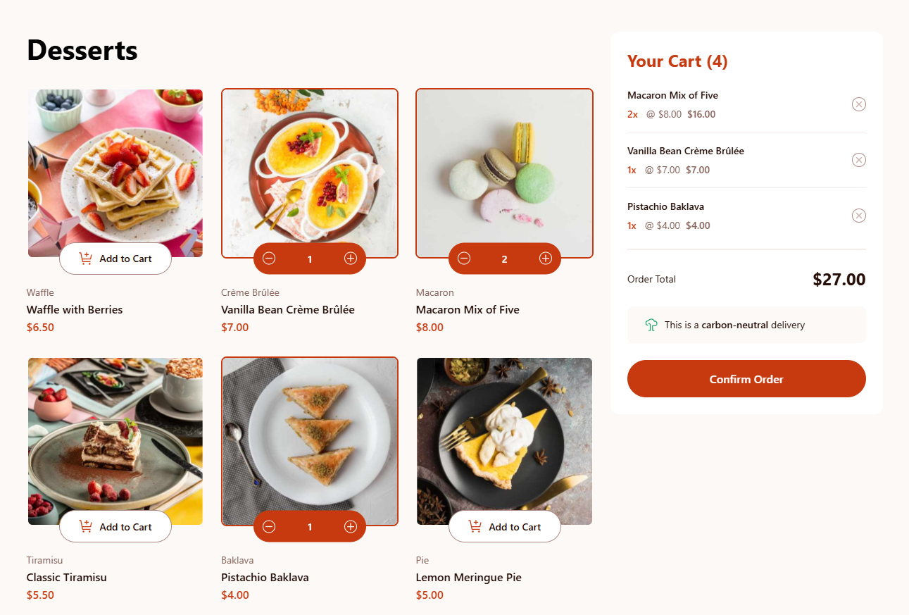

# Frontend Mentor - Product list with cart solution

This is a solution to the [Product list with cart challenge on Frontend Mentor](https://www.frontendmentor.io/challenges/product-list-with-cart-5MmqLVAp_d). Frontend Mentor challenges help you improve your coding skills by building realistic projects.

## Table of contents

- [Overview](#overview)
  - [The challenge](#the-challenge)
  - [Screenshot](#screenshot)
  - [Links](#links)
- [My process](#my-process)
  - [Built with](#built-with)
  - [What I learned](#what-i-learned)
  - [Continued development](#continued-development)
  - [Useful resources](#useful-resources)
- [Author](#author)

## Overview

### The challenge

Users should be able to:

- Add items to the cart and remove them
- Increase/decrease the number of items in the cart
- See an order confirmation modal when they click "Confirm Order"
- Reset their selections when they click "Start New Order"
- View the optimal layout for the interface depending on their device's screen size
- See hover and focus states for all interactive elements on the page

### Screenshot

### Links

- Solution URL: [Github Repo](https://github.com/morauszkia/fm-product-list-react)
- Live Site URL: [Github Pages](https://morauszkia.github.io/fm-product-list-react/)

## My process

### Built with

- Semantic HTML5 markup
- Flexbox for Components
- CSS Grid for overall layout
- CSS custom properties for colors and transition states
- Responsive units, images, layouts supplemented with media queries
- Mobile-first workflow
- [React](https://reactjs.org/) - JS library
- [Context API](https://react.dev/reference/react/createContext) - For state management
- [React Portal](https://react.dev/reference/react-dom/createPortal) - For rendering components to other parts of the DOM
- [localStorage API](https://developer.mozilla.org/en-US/docs/Web/API/Window/localStorage) - For data persistence across sessions
- [CSS Modules](https://github.com/css-modules/css-modules) - For scoped styles
- [Vite](https://vite.dev/) - Build tool

### What I learned

Styling SVGs, especially, to change their fill on hover was a challenge. Luckily, importing them as React Components did the trick, and made it possible to change their fill with CSS. I needed [vite-plugin-svgr](https://www.npmjs.com/package/vite-plugin-svgr) to do that.

Another challenge was having a different transition based on the screen width. I solved this problem by using CSS custom properties for the initial and final states (transform and opacity), and changed these based on a media query.

### Continued development

I would love to replicate this small app in other frameworks, like Vue.js or Svelte. Also, I would like to expand the list of desserts, maybe add other categories of foods, and have some sort of filtering and/or pagination.

### Useful resources

- [vite-plugin-svgr](https://www.npmjs.com/package/vite-plugin-svgr) - This plugin, installed as a dev dependency made it possible to import the svg images as React Components and style them with CSS.
- [Deployment to Github Pages](https://vite.dev/guide/static-deploy) - Vite docs on the deployment of static pages to Github Pages

You can find more information on the technologies and APIs used in the Built with section.

## Author

- Frontend Mentor - [@mantis](https://www.frontendmentor.io/profile/morauszkia)
- X - [@mantis_hu86](https://x.com/mantis_hu86)
- Github - [@mantis](https://github.com/morauszkia)
- LinkedIn - [András Morauszki](https://www.linkedin.com/in/andras-morauszki/)
